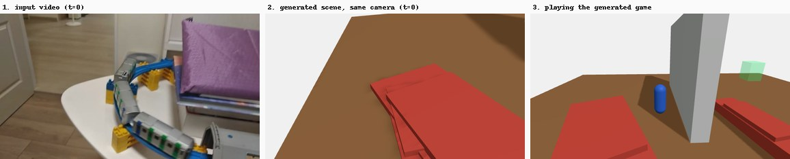
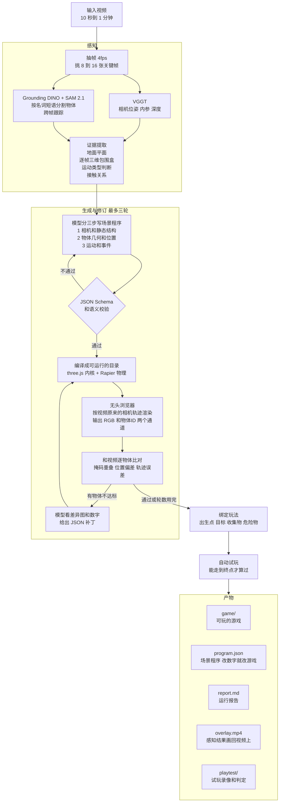
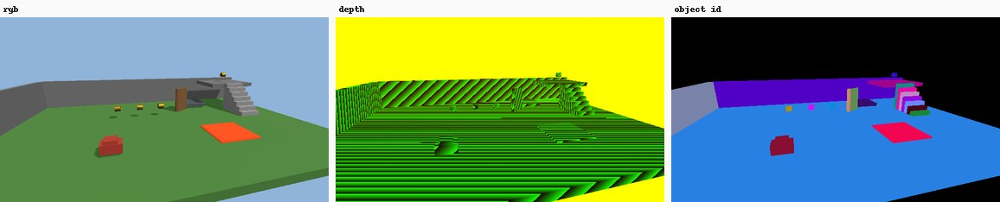
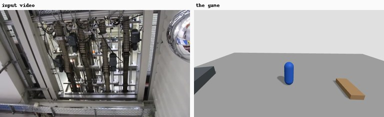

# GameWorldModel

给它一段十几秒到一分钟的普通视频，它把视频里的场景和会动的东西恢复成一份可执行的场景程序，再编译成一个能在浏览器里玩的 three.js 小游戏。中间没有人工建模，场景程序也是模型看着视频写出来的。



左边是输入的视频，一列玩具火车在地板的轨道上跑。中间是恢复出来的场景用同一条相机轨迹渲染的画面，两块红色是被认出来的两节车厢。右边是生成的游戏，蓝色胶囊是玩家，绿色方块是终点。几何还很抽象，因为这一版还没接素材库，物体都是方块和圆柱这样的替身。

## 怎么做到的

视频先抽帧。VGGT 估计相机位姿和深度，Grounding DINO 加 SAM 2.1 按名词短语把物体分割出来并跨帧跟踪。这些结果整理成一份证据文件，里面有地面平面、每个物体随时间的三维包围盒和运动类型猜测。然后一个视觉语言模型分三步写出场景程序，先写相机和静态结构，再写物体，最后写运动和事件。程序过完校验就编译成一个可以独立运行的游戏目录，固定的 three.js 内核负责解释它，Rapier 提供物理。

编译好的场景在无头浏览器里按视频原来的相机轨迹重新渲染，和视频逐物体比对掩码重叠、位置和轨迹误差，不合格的地方交给模型修订，最多三轮。通过之后绑定第三人称平台跳跃模板，自动试玩一遍确认能走到终点，最后产出报告。



比对靠的是内核额外渲染的两个通道。左边是正常画面，中间是深度，右边每个物体一种纯色，拿它和视频里分割出来的掩码算重叠，就知道哪个物体放错了位置或者大小。



模型默认走 OpenRouter 上的 GLM-4.6V，一条视频大约六次调用，一美分左右。换模型改一个配置文件就行。没有 key 也能跑，加 `--no-vlm` 就直接从感知结果翻译出场景程序，整条链一样走完。

## 上手

详细安装和资源需求看 [RUNNING.md](RUNNING.md)，分了在自己电脑上跑和在 HPC 集群上跑两种情况。最短路径是

```bash
pip install -r requirements.txt && npm install      # 再装 VGGT，见 RUNNING.md
python3 scripts/download_weights.py                 # 感知权重 9.6 GB
python3 -m gwm.run_clip --video data/clips/trimmed/我的视频.mp4 --clip 我的视频 \
  --phrases "toy train,train track,floor"
```

跑完进 `out/我的视频/<运行编号>/`，`node harness/serve.mjs game 8000` 就能在浏览器里玩。WASD 移动，空格跳，R 在回放和游玩之间切换。

不想下权重也能先玩起来：`python3 -m gwm.compiler.compile examples/handwritten/program.json /tmp/game` 把仓库里手写的示例场景编译成游戏，改 JSON 里的数字再编译一次，就能看出场景程序是怎么控制游戏的。

## 文档

| 看什么 | 去哪 |
|---|---|
| 怎么装、怎么跑、需要多少资源 | [RUNNING.md](RUNNING.md) |
| 想改代码，PR 流程和代码约定 | [CONTRIBUTING.md](CONTRIBUTING.md) |
| 系统怎么搭的：模块、数据流、接口契约、场景程序 DSL | [docs/architecture.md](docs/architecture.md) |
| 每一层为什么这么选：感知、模型、反馈、运行时、素材 | [docs/design-notes.md](docs/design-notes.md) |
| 现在跑出什么结果、和设计差在哪、有哪些已知问题 | [docs/status.md](docs/status.md) |
| 三段视频的实际产物，报告和截图 | [docs/results/](docs/results/) |
| 相关工作 | [docs/related-work.md](docs/related-work.md) |
| 研究提案 | [RP.md](RP.md) |
| 前期调研的原始报告 | [survey/](survey/) |

## 项目目录

```
gwm/                  Python 管线，入口是 run_clip.py
  perception/         抽帧、几何、分割、证据提取（后端可换）
  synthesis/          模型客户端、三阶段生成、批评、修订循环、证据直译
  compiler/           JSON Schema、校验、素材解析、打包成 game 目录
  feedback/           调渲染、算指标、出逐物体的 pass/fail 子句
  binding/            玩法绑定，推断出生点目标收集物
  playtest/           自动试玩和判定
  config.py errors.py taxonomy.py
kernel/               浏览器里的固定运行时，只吃数据不含生成代码
harness/              Playwright 驱动内核做渲染、试玩、录像
compiler 的 schema、configs/、prompts/、examples/、tests/、scripts/
docs/                 设计文档、结果、配图
survey/               调研原始报告
data/clips/           视频          ┐
out/                  每次运行的产物 ├ 都不进 git
.secrets/             API key       ┘
```

## 现在做到什么程度

三段视频都能从头走到尾，自动试玩都能走到终点。一段玩具火车在地板轨道上跑的视频，一段工厂输送线的俯拍视频，还有一段我们自己渲染的合成场景。



运动的判断在合成场景上比较准，升降平台、定时开关的门、来回跑的矿车都认对了；在真实视频上还不稳，相机一动静止的东西容易被判成在动。具体数字、与设计文档的差异和已知问题都在 [docs/status.md](docs/status.md)。
